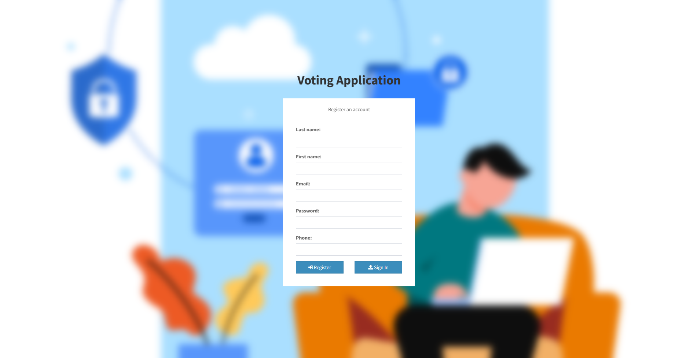
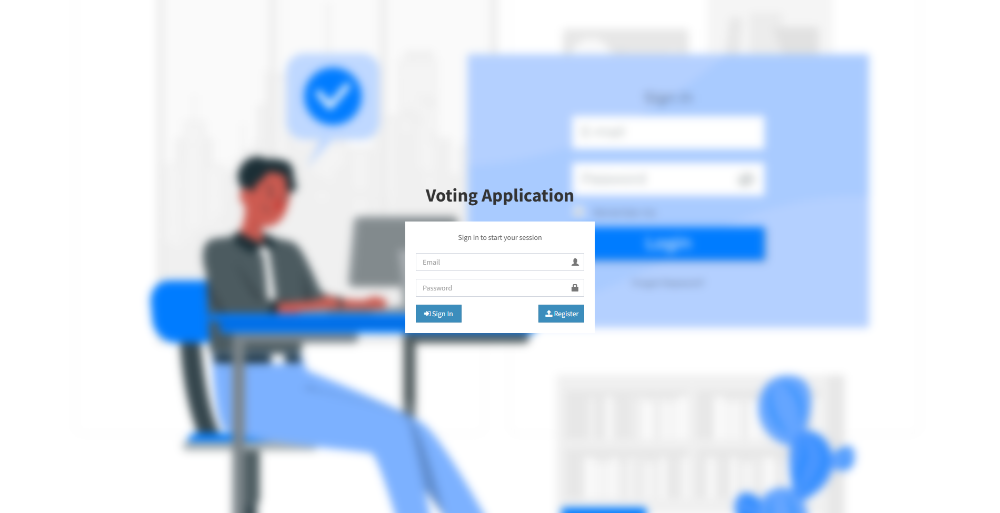
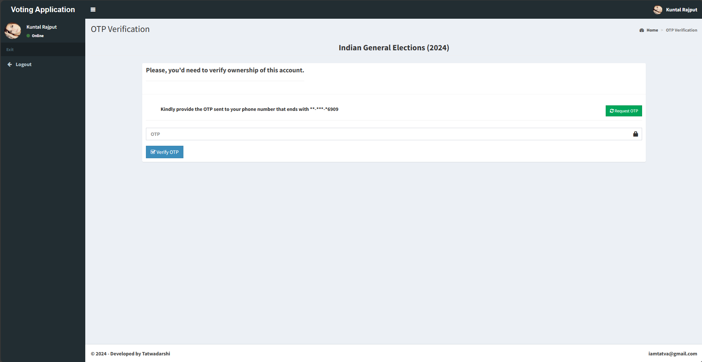
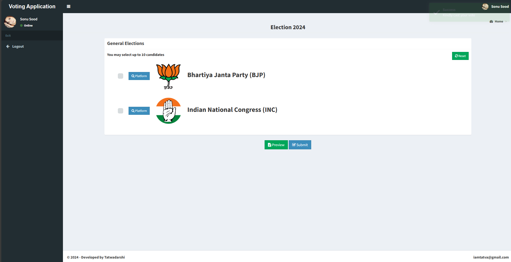
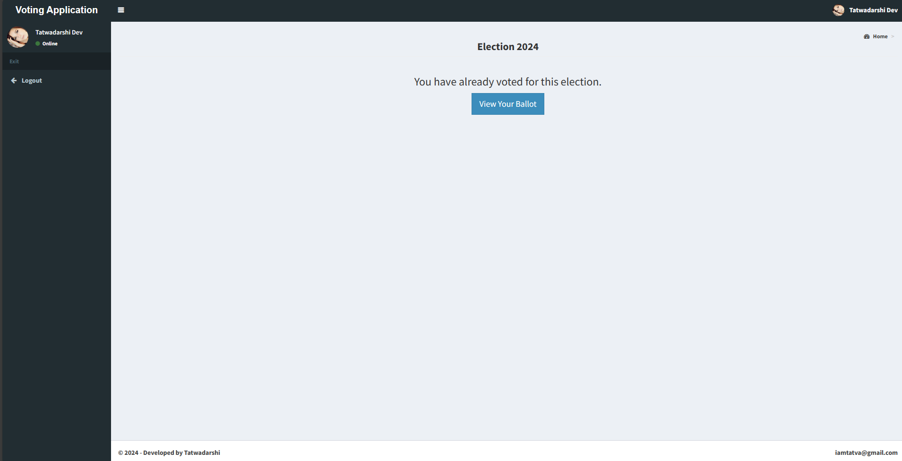
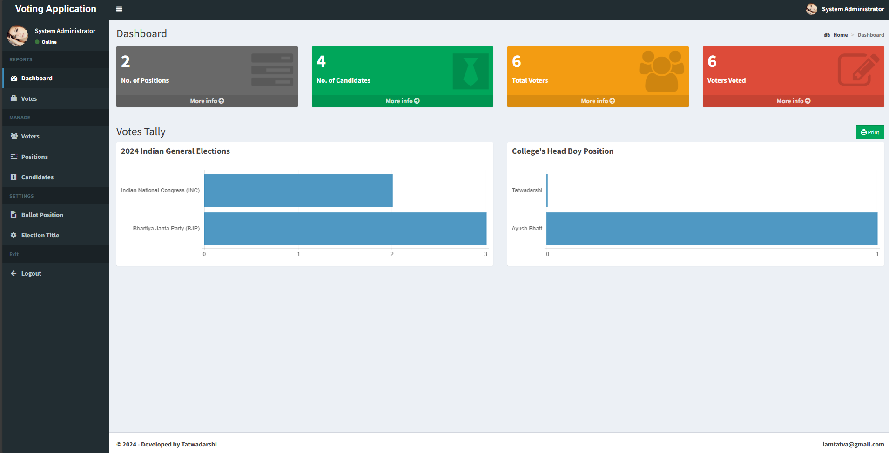

# Voting Web Application Using Django Framework

## Description

The Voting Web Application is a platform developed using the Django framework, aimed at facilitating electronic voting processes to enhance accessibility, efficiency, and integrity in democratic participation, thereby fostering trust in the electoral system in online mode.

## Technologies Used

- Django
- Python
- HTML/CSS
- JavaScript
- SQLite
- Bootstrap

## Screenshots

| Screenshot 1 | Screenshot 2 |
|--------------|--------------|
|  |  |
|  |  |
|  |  |

## License

This project is released under the [MIT License](LICENSE). You can find the specific terms and conditions outlined in the LICENSE file. This means you're free to utilize, modify, and distribute the project according to the terms of the MIT License.

## Contributors

- [Tatwadarshi](https://github.com/dev7091)
